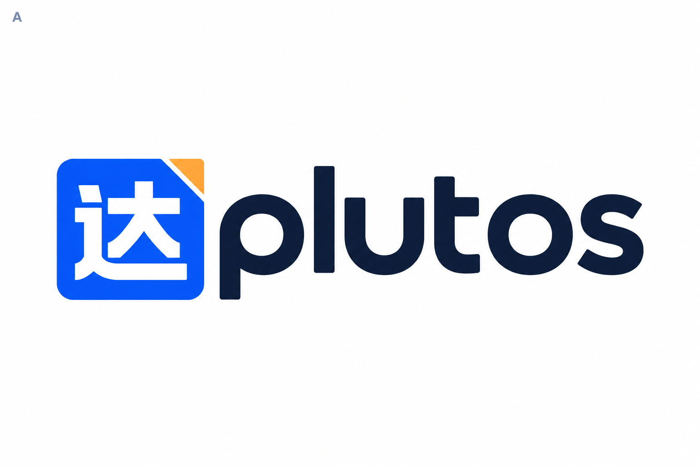
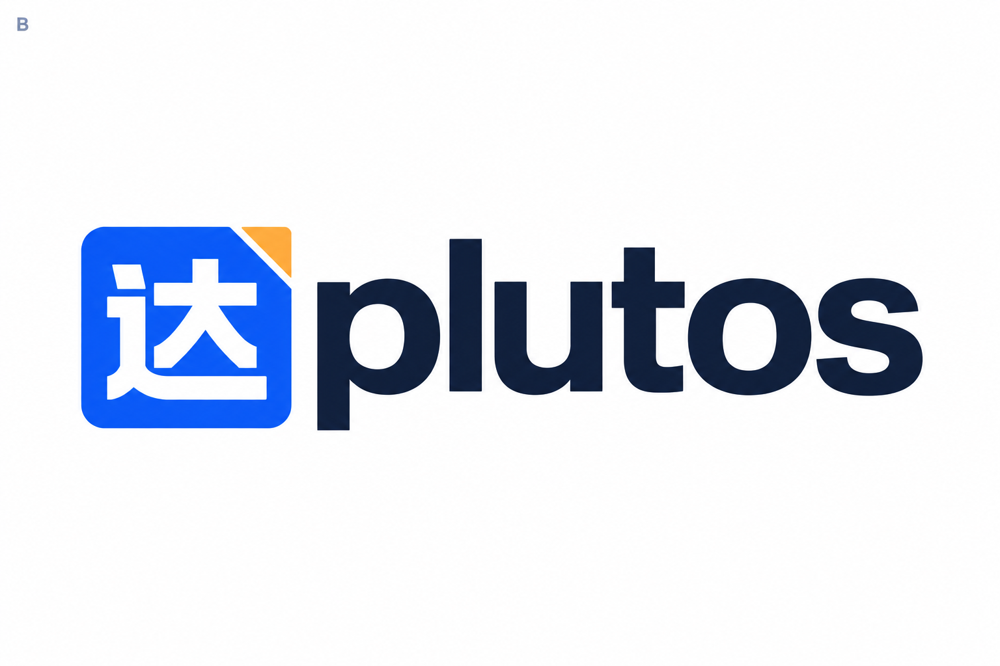
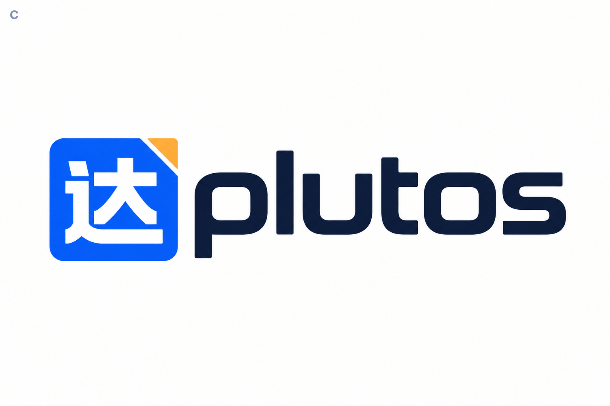
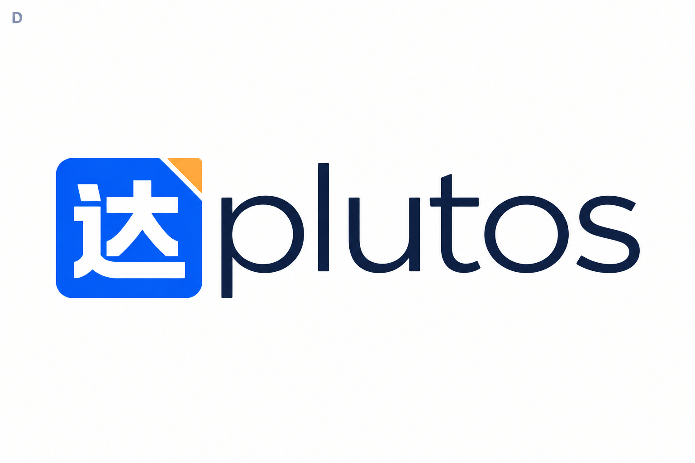
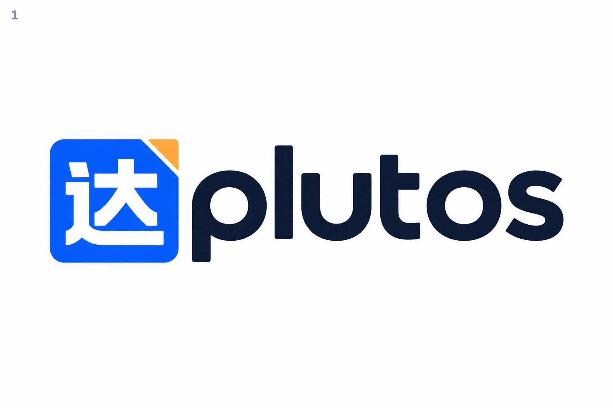
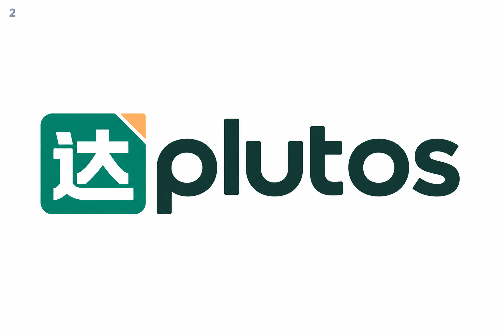
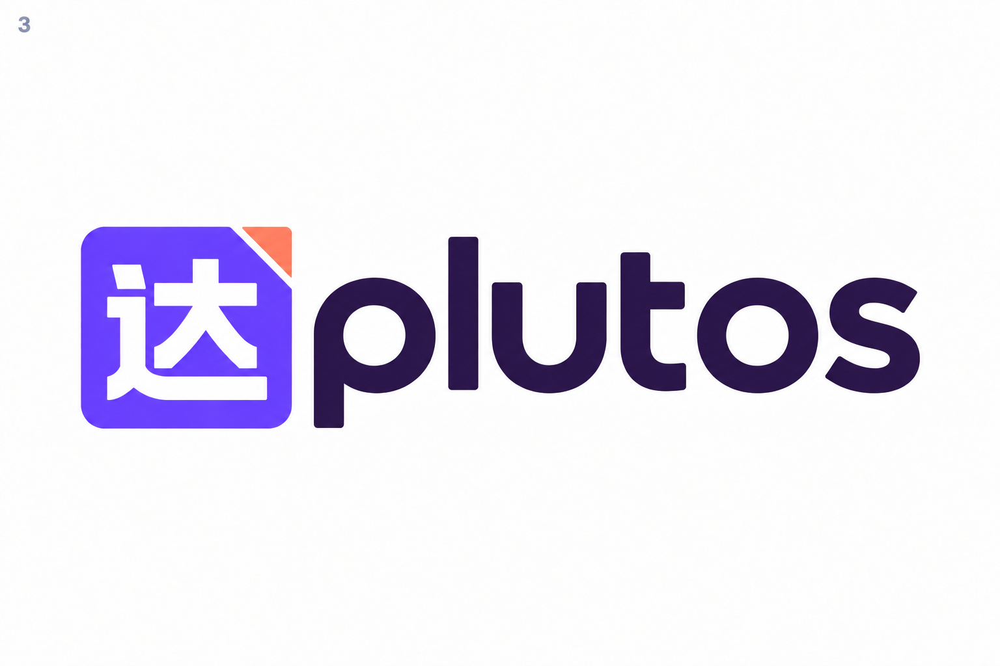
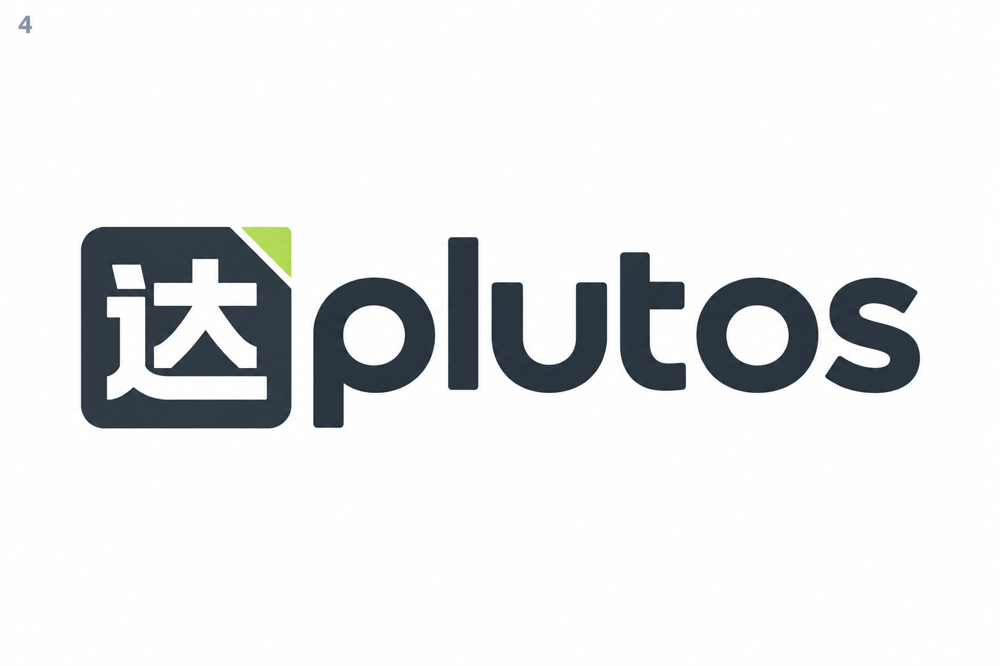

# Plutos — symbole 02, typographies et couleurs

Le symbole carré **02 — Sceau** est conservé : caractère blanc 达, coin replié et séparation diagonale. Le nom **plutos** reste visible à côté du symbole.

## Planche 1 — Quatre pistes typographiques

Même palette cobalt / ambre pour comparer le lettrage. Les noms ci-dessous désignent les directions visuelles proposées ; les images ne certifient pas l'emploi d'un fichier de police précis.

| A — Géométrique fluide | B — Grotesque précise |
| --- | --- |
|  |  |
| C — Technique moderne | D — Humaniste légère |
|  |  |

## Planche 2 — Quatre palettes

La piste typographique A sert de base commune aux essais de couleurs.

| 1 — Cobalt & ambre | 2 — Émeraude & abricot |
| --- | --- |
|  |  |
| 3 — Violet & corail | 4 — Graphite & citron |
|  |  |

| Palette | Symbole | Coin | Nom |
| --- | --- | --- | --- |
| 1 — Cobalt & ambre | #2455F5 | #FFB547 | #101A34 |
| 2 — Émeraude & abricot | #008767 | #FFBA73 | #123A32 |
| 3 — Violet & corail | #6D4AFF | #FF876A | #251844 |
| 4 — Graphite & citron | #26313C | #B8E44B | #26313C |

Les codes sont les cibles de palette pour la mise au propre du concept sélectionné.

**Choix conseillé : typographie A + palette 2 (émeraude et abricot)**. Les lettres rondes sont lisibles et le vert s'accorde avec l'identité actuelle de l'application. La palette 1 conserve le bleu cobalt de la proposition initiale.

## Fichiers

Huit propositions PNG sur fond blanc, générées avec l'outil imagegen intégré. Les sources de la première série restent disponibles dans le dossier voisin `plutos-logos-v1`.

[Prompts exacts](prompts.md).
